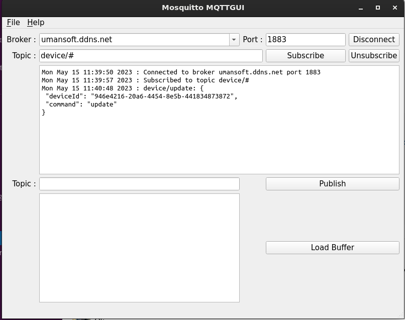

# mqttWrapper Project

## Overview

This repository contains the code used to create an MQTT connection with a broker. This project uses the `mosquitto client` MQTT library to provide the MQTT connection.

## mqttgui

The mqtt GUI application demonstrates the usage of the mqtt wrapper class.

